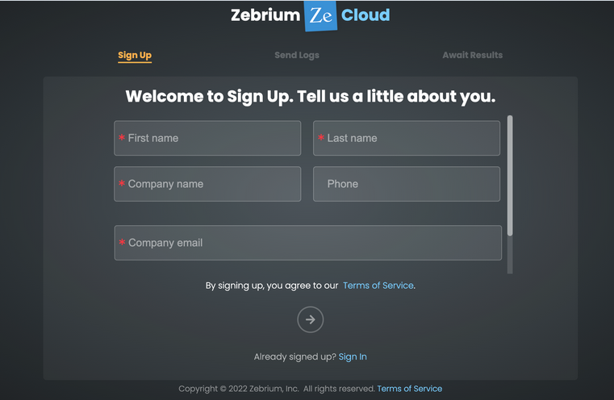
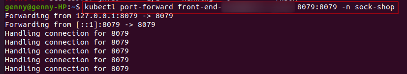

# Autonomous-Machine-Learning

### Autonomous ML-based detection and identification of root cause for incidents in microservices running on EKS.


### What is Machine Learning?

Machine learning is a branch of artificial intelligence (AI) and computer science. It is  an important component of the growing field of data science. Through the use of statistical methods, algorithms are trained to make classifications or predictions, uncovering key insights within data mining projects. 


### How machine learning works?

According to the University of California-Berkeley, the learning system of a machine learning algorithm breaks out into three main parts.

- A Decision Process: In general, machine learning algorithms are used to make a prediction or classification. 

- An Error Function: It serves to evaluate the prediction of the model.

- An Model Optimization Process: If the model can fit better to the data points in the training set, then weights are adjusted to reduce the discrepancy between the known example and the model estimate.


In this project, I will demonstrate an alternative approach that uses the Zebrium machine learning (ML) platform to automatically find root cause in logs generated by an application deployed in Amazon EKS.


The project will cover:

- Installing the [Sock Shop](https://microservices-demo.github.io/) microservices demo app in an EKS cluster
- Installing Zebrium log collector
- Breaking the demo app (using a chaos engineering tool) and verifying that the Zebrium platform automatically finds the root cause.

#### Prerequisites

1. An active AWS account.


2. AWS CLI with the IAM user having admin permission or having all the permissions to execute the setup.


3. A free [Zebrium](http://www.zebrium.com/sign-up) trial account.


### Step 1. Create and configure an EKS cluster


The cluster.yaml file 


Navigate the Elastic Kubernetes Service console on AWS and look for the cluster **eks-litmo-demo** that was created.


### Step 2. Create a Zebrium account and install the log collector





```
helm upgrade -i zlog-collector zlog-collector --namespace zebrium --create-namespace --repo https://raw.githubusercontent.com/zebrium/ze-kubernetes-collector/master/charts --set zebrium.collectorUrl=https://cloud-ingest.zebrium.com,zebrium.authToken=XXXX
```


Zebrium is now install.

After a few minutes, the logs on the Zebrium UI should be viewable as below:


### Install and Fire up the Sock Shop demo app

Now that the Kubernetes environment is set up, I will utilize Zebrium's machine learning platform to detect and learn the log patterns.

The demo microservices app that I will use is called [Sock Shop](https://microservices-demo.github.io/). It is a demo app that simulates the key components of the user-facing part of an e-commerce website. It is built using components such as Spring Boot, Go kit, and Node.js. It is also packaged in Docker containers.

- To begin, install Sock Shop from a .yaml file using the following command:

```
kubectl create -f https://raw.githubusercontent.com/zebrium/zebrium-sockshop-demo/main/sock-shop-litmus-chaos.yaml
```

**NOTE:** Please be patient as the pods are being created. DO NOT move on to the next step until all pods are in a Running state.

- To check the status of the pods, type the following command:

```
kubectl get pods -n sock-shop
```


Once all the services are running, I can visit the app on my web browser! However, in order to achieve this, I must set up port forwarding, then get the front-end IP address and port as follow:

- Run the command below in a separate shell window:

```
kubectl get pods -n sock-shop | grep front-end
```


- Next, use pod name from the above command in place of XXX’s




- Let's open the ip_address:port from above (in this case: 127.0.0.1:8079) in a new tab on a web browser! I can now interact with the Sock Shop app. Navigate the website and verify that it is working correctly.


### PART 3: Install the Litmus Chaos Engine


In this section, we are going to install and use the Litmus Chaos Engine to deliberately “break” the functionality of the Sock Shop application.

- Begin by installing the Litmus Chaos components as well as create an appropriate role-based access control (RBAC) for the pod-network-corruption test:

```
helm repo add litmuschaos https://litmuschaos.github.io/litmus-helm/
```

```
helm upgrade -i litmus litmuschaos/litmus-core -n litmus --create-namespace
```


- Continue the instillation by typing this command:

```
kubectl apply -f "https://hub.litmuschaos.io/api/chaos/1.13.6?file=charts/generic/experiments.yaml" -n sock-shop
```


- Next, I setup a service account with the appropriate RBAC to run the network corruption experiment using the following command:

```
$ kubectl apply -f https://raw.githubusercontent.com/zebrium/zebrium-sockshop-demo/main/pod-network-corruption-rbac.yaml
```

- Lastly, make note of the time using the following command:

```
date
```


### PART 4: Generating Machine-Learning Logs

In this section, we will take at least 2 hours for baseline log data collection. The reason for this is because we have just created our new EKS cluster, new app, and new Zebrium account. We must allow the Zebrium ML platform enough time to recognize normal log patterns.


### PART 5: Break The Sock Shop

Now that at least 2 hours have reached, the Zebrium ML platform has had enough time to gather a baseline of the logs. I will deliberately disrupt the environment by running a Litmus network corruption chaos experiment.

- Begin by running the following command to start the network corruption experiment:


```
$ kubectl apply -f https://raw.githubusercontent.com/zebrium/zebrium-sockshop-demo/main/pod-network-corruption-chaos.yaml
```
