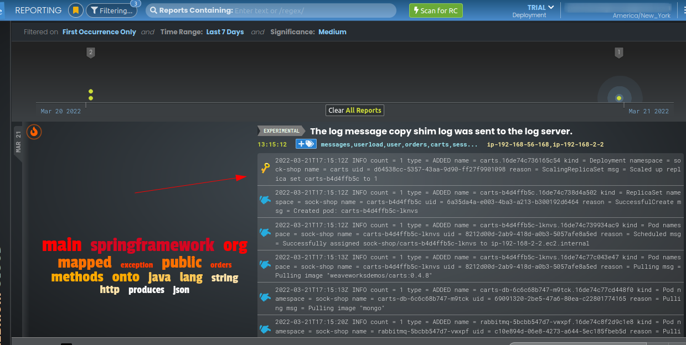

# Autonomous-Machine-Learning

### Autonomous ML-based detection and identification of root cause for incidents in microservices running on EKS.


### What is Machine Learning?

Machine learning is a branch of artificial intelligence (AI) and computer science. It is  an important component of the growing field of data science. Through the use of statistical methods, algorithms are trained to make classifications or predictions, uncovering key insights within data mining projects. 


### How machine learning works?

According to the University of California-Berkeley, the learning system of a machine learning algorithm breaks out into three main parts.

- A Decision Process: In general, machine learning algorithms are used to make a prediction or classification. 

- An Error Function: It serves to evaluate the prediction of the model.

- An Model Optimization Process: If the model can fit better to the data points in the training set, then weights are adjusted to reduce the discrepancy between the known example and the model estimate.


In this project, I will demonstrate an alternative approach that uses the Zebrium machine learning (ML) platform to automatically find root cause in logs generated by an application deployed in Amazon EKS.


The project will cover:

- Installing the [Sock Shop](https://microservices-demo.github.io/) microservices demo app in an EKS cluster
- Installing Zebrium log collector
- Breaking the demo app (using a chaos engineering tool) and verifying that the Zebrium platform automatically finds the root cause.

### Part One: Prerequisites

**1.** An active AWS account.


**2.** AWS CLI with the IAM user having admin permission or having all the permissions to execute the setup.

- Setup the user with admin permission.


- Then sign-up with the IAM user creditials that I created.


**3.** A free [Zebrium](http://www.zebrium.com/sign-up) trial account.


### Step 1. Create and configure an EKS cluster


- The cluster.yaml file 


- Navigate the Elastic Kubernetes Service console on AWS and look for the cluster **eks-litmo-demo** that was created.


### Step 2. Create a Zebrium account and install the log collector

Here is the link to Zebrium webpage:
[Zebrium](http://www.zebrium.com/sign-up)


- On the Log Collector Setup page, copy the Helm command from the Zebrium Send Logs page.

**Note:** Do not install the log collector just yet! I will modify it in the upcoming steps.


```
helm upgrade -i zlog-collector zlog-collector --namespace zebrium --create-namespace --repo https://raw.githubusercontent.com/zebrium/ze-kubernetes-collector/master/charts --set zebrium.collectorUrl=https://cloud-ingest.zebrium.com,zebrium.authToken=XXXX
```

- In the Helm command I copied from the Zebrium page, delete the following parts of the line:

```
zebrium.timezone=KUBERNETES_HOST_TIMEZONE

zebrium.deployment=YOUR_SERVICE_GROUP
```

Below is an example of the Helm command with the deleted portions (I ensure to substitute XXXX for my actual token):

```
$ helm upgrade -i zlog-collector zlog-collector --namespace zebrium --create-namespace --repo https://raw.githubusercontent.com/zebrium/ze-kubernetes-collector/master/charts --set zebrium.collectorUrl=https://cloud-ingest.zebrium.com,zebrium.authToken=XXXX
```


After I run the Helm command in Terminal, the Zebrium UI should detect that logs have been received. The Zebrium pop-up will look something like this:


**Zebrium is now install.**


After a few minutes, the logs should be viewable on Zebrium web UI.





### PART TWO: Install and Fire up the Sock Shop demo app

Now that the Kubernetes environment is set up, I will utilize Zebrium's machine learning platform to detect and learn the log patterns.

The demo microservices app that I will use is called [Sock Shop](https://microservices-demo.github.io/). It is a demo app that simulates the key components of the user-facing part of an e-commerce website. It is built using components such as Spring Boot, Go kit, and Node.js. It is also packaged in Docker containers.

- To begin, install Sock Shop from a .yaml file using the following command:

```
kubectl create -f https://raw.githubusercontent.com/zebrium/zebrium-sockshop-demo/main/sock-shop-litmus-chaos.yaml
```

**NOTE:** Please be patient as the pods are being created. **DO NOT** move on to the next step until all pods are no longer in a Running state.

- To check the status of the pods, type the following command:

```
kubectl get pods -n sock-shop
```


Once all the services are running, I can open the app on my web browser! However, in order to achieve this, I must set up port forwarding, then get the front-end IP address and port as follow:

- Run the command below in a separate shell window:

```
kubectl get pods -n sock-shop | grep front-end
```


- Next, use pod name from the above command in place of XXX’s


- Let's open the ip_address:port from above (in this case: 127.0.0.1:8079) in a new tab on a web browser! I can now interact with the Sock Shop app. Navigate the website and verify that it is working correctly.


### PART THREE: Install the Litmus Chaos Engine


In this section, I install and use the Litmus Chaos Engine to deliberately “break” the functionality of the Sock Shop application.

- Begin by installing the Litmus Chaos components as well as create an appropriate role-based access control (RBAC) for the pod-network-corruption test:

```
helm repo add litmuschaos https://litmuschaos.github.io/litmus-helm/
```

```
helm upgrade -i litmus litmuschaos/litmus-core -n litmus --create-namespace
```


- Continue the installation by typing this command:

```
kubectl apply -f "https://hub.litmuschaos.io/api/chaos/1.13.6?file=charts/generic/experiments.yaml" -n sock-shop
```


- Next, I setup a service account with the appropriate RBAC to run the network corruption experiment using the following command:

```
$ kubectl apply -f https://raw.githubusercontent.com/zebrium/zebrium-sockshop-demo/main/pod-network-corruption-rbac.yaml
```

- Lastly, make note of the time using the following command:

```
date
```


### PART FOUR: Generating Machine-Learning Logs

This section will take at least 2 hours for baseline log data collection. The reason for this is because I have just created a new EKS cluster, new app, and new Zebrium account.  It is very important to allow the Zebrium ML platform enough time to recognize normal log patterns.

**The waiting time may varied from a 10 minutes to 2 hours.** It is all depends how deep is the issue.


### PART FIVE: Break The Sock Shop

Now that at least the time has reached,the Zebrium ML platform has had enough time to gather a baseline of the logs. I will deliberately disrupt the environment by running a Litmus network corruption chaos experiment.

- Begin by running the following commands to start the network corruption experiment:


```
kubectl apply -f https://raw.githubusercontent.com/zebrium/zebrium-sockshop-demo/main/pod-network-corruption-chaos.yaml
```

- Be sure to make note of the date:

```
date
```

- It will take a moment for the pod-network-corruption-helper to reach a Running state. Check the status of it by using the following command:

```
kubectl get pods -n sock-shop -w
```
**Note:** In order to stop the kubectl command
 Type ^C 

 


As soon as the the Chaos experiment has started running, I was able to go back to the Sock Shop UI of my web browser. As I navigate around the website, however I may notice some operations have slightly failed.


### PART SIX: Results and Interpretation.

As that the chaos experiment is now complete, let's allow some time for the Zebrium ML platform to detect the errors. This may take up to 10 minutes.

Manually I refresh my web browser window a couple of times, the actual root cause reports were different across runs. 

This is because of many factors, including the learning period, what events occurred while learning, the timing and order of the log lines while the experiment was running, other things happening on the system, and so on.

The reporting page contains a summary list of all the root cause reports found by the machine learning. There are three useful parts of the summary:

**1. Plain language NLP summary:** This is an experimental feature where we use the GPT-3 language model to construct a summary of the report. The summary provides some useful context about the problem.

**2. Log type(s) and host(s):** The log type and host (front end, events, orders, and messages) that contain the events for the incident.


**3. “Hallmark” events:** The ML picks out one or two events that it believes will define the problem.


Here is a summary of the root cause errors that were generated in my Zebrium account:


**First error:** Cart Undefined.

Everything I am adding a new item to the cart, the cart at first shows **0**, then switch to the correct number of added items. 


**Second error:** Catalog page error.

When I try to request the catalog page, I observe some error tag results.


### Conclusion

The process of troubleshooting and tracking down the root cause of an incident in a distributed application is becoming more and more difficult and time-consuming.

For this project, I utilize the principles of Chaos Engineering to deliberately "break" the Sock Shop microservices application. The Zebrium machine learning technology was able to detect this and build a root cause report that detailed the root cause.

This experiment shows how I an use machine learning to automatically find a correlated cluster of anomalies that represents a set of log lines that explains the root cause. The technology is designed to work with any kind of application and does not require manual training or large training data sets.